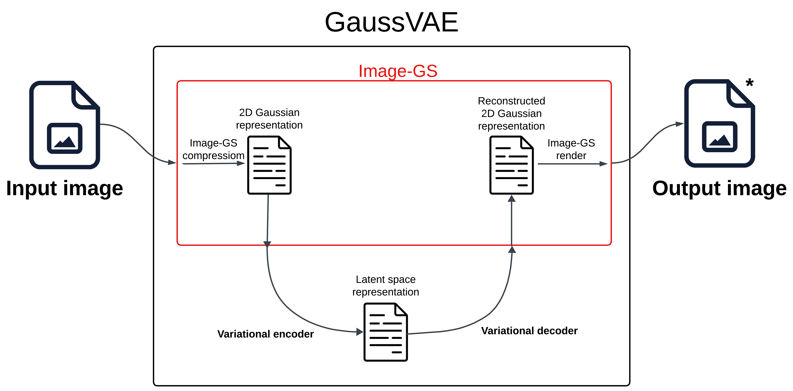
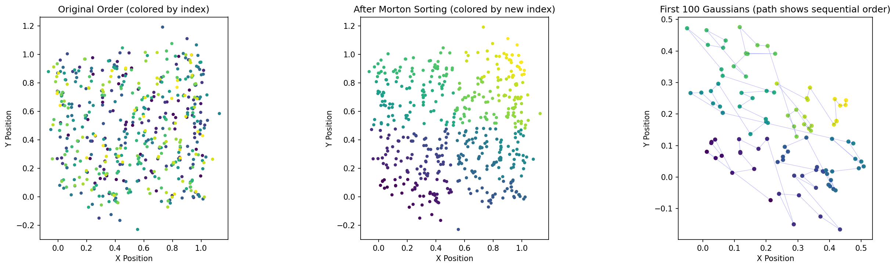

# GaussVAE: Compression of 2D Gaussian Splatting via Variational Autoencoders

**Author:** Roko Čubrić  
**Institution:** Faculty of Electrical Engineering and Computing, University of Zagreb \
**Status:** Early-stage development, active experimentation


---

## Motivation

Inspired by recent advances in deep neural networks and variational autoencoders, and considering the increasing integration of AI systems in robotics, I pursued a novel approach to image compression. Modern autonomous systems require efficient visual memory management: robots operating in complex environments must store extensive visual information within limited onboard memory while maintaining sufficient fidelity for navigation and decision-making tasks. This constraint motivates the development of specialized compression techniques that balance memory efficiency with perceptual quality.

Traditional image compression via variational autoencoders typically operates directly on pixel representations. While effective, these methods often employ block-based encoding schemes that partition images into fixed-size regions, processing each independently. This approach can introduce blocking artifacts and fails to leverage global structural coherence within natural images.

In 2025, Intel Research introduced Image-GS, a technique that represents images as collections of 2D Gaussian splats—differentiable primitives that can be optimized to reconstruct images with high fidelity. Each Gaussian is parametrized by position, scale, rotation, and color, providing a continuous, object-centric representation rather than a pixel grid. This representation naturally captures image structure and has demonstrated promising reconstruction quality.

Building on this foundation, I hypothesized that variational autoencoders could exploit their pattern recognition and learned embedding capabilities to further compress these Gaussian representations. Rather than compressing pixels, this approach compresses the learned Gaussian parameters themselves, potentially achieving superior compression ratios while maintaining reconstruction quality. The inherent trade-off is the loss of exact pixel-level details, which is acceptable for many perception tasks where structural and semantic content preservation is prioritized over lossless reconstruction.

## Architecture



The system implements a two-stage compression pipeline:

1. **Image-GS Stage:** Images are encoded into 512 2D Gaussian splats, each parametrized by 8 values (position, scale, rotation, RGB features).
2. **VAE Stage:** The Gaussian parameters are compressed via a variational autoencoder from 4096 dimensions (512 × 8) to a 512-dimensional latent representation, achieving 8:1 compression.

### Preprocessing: Morton Space-Filling Curve



To preserve spatial locality when treating 2D Gaussian positions as a 1D sequence, I employ Morton ordering (Z-order curve). This space-filling curve interleaves the x and y coordinates of Gaussian centers, ensuring that spatially adjacent Gaussians remain close in the sequential representation. This preprocessing step is critical for 1D convolutional networks to learn meaningful spatial patterns.

### Network Architectures

Two architectures have been implemented and tested:

**1. Baseline Conv1D VAE (1.6M parameters):**
- Encoder: Three 1D convolutional layers with progressive channel expansion (32 → 64 → 128 filters)
- Latent space: 256 or 512 dimensions
- Decoder: Three 1D convolutional layers with progressive channel reduction (64 → 32 → 16 filters)
- Activation: ReLU throughout
- Loss: MSE reconstruction + β-weighted KL divergence with linear annealing

**2. ResNet Conv1D VAE (~16M parameters):**
- Encoder: Five ResNet blocks with residual connections (32 → 256 filters)
- Latent space: 512 dimensions
- Decoder: Five ResNet blocks with residual connections (256 → 16 filters)
- Improved gradient flow via skip connections
- Same loss formulation as baseline

Both networks process the spatially-sorted Gaussian parameters using 1D convolutions, treating the sequence of 512 Gaussians as a temporal signal.

## Current Results and Challenges

As of November 16, 2025, the training results indicate significant challenges that require further investigation:

**Primary Issue: High Reconstruction Bias**

The current models exhibit high bias in reconstruction, particularly affecting rotation and color feature parameters. Analysis of six training runs (runs 002-006) reveals the following patterns:

- Position (xy) parameters: Loss converges to ~0.1 (acceptable)
- Scale parameters: Loss converges to ~0.2 (acceptable)  
- Rotation parameters: Loss plateaus at ~1.0-1.2 (poor)
- Color features: Loss plateaus at ~1.0 (poor)

**Visual Results:**

For detailed reconstruction visualizations and quantitative comparisons, see `notebooks/08_vae_multi_image_demo.ipynb` in the [complete repository](https://github.com/rokocuba/gaussvae).

**Ongoing Experiments:**

I am currently investigating loss weighting strategies and architectural modifications to address these imbalances. Additional experiments will explore:
- Alternative loss formulations (perceptual losses, adversarial training)
- Increased model capacity and training duration
- Curriculum learning strategies (progressive complexity increase)

The project remains in early-stage development, and these challenges are expected in novel applications of established techniques. I am committed to systematic experimentation to identify effective solutions.

## Experimental Setup

**Hardware:** Google Cloud Compute Engine VM with NVIDIA Tesla T4 GPU (16GB VRAM)  
**Framework:** TensorFlow 2.12, CUDA 11.8  
**Dataset:** 11,501 abstract art images (Delaunay triangulation), split 10,502 train / 500 validation / 499 test  
**Reproducibility:** All experiments conducted in Docker containers with fixed random seeds

## Usage

The codebase is structured for reproducible experimentation but should be considered early-stage research software. The training pipeline has not been extensively tested beyond the initial experiments documented here.

### Environment Setup

Build Docker images:
```bash
docker-compose build
```

Launch Jupyter environment:
```bash
docker-compose up -d jupyter
# Access at http://localhost:8888
```

### Training

Train baseline model:
```bash
docker-compose run --rm vae python scripts/train_conv1d_vae.py \
  --config configs/conv1d_512d.yaml \
  --output experiments/my_experiment
```

Train ResNet model:
```bash
docker-compose run --rm vae python scripts/train_resnet_conv1d_vae.py \
  --config configs/resnet_conv1d_512d.yaml \
  --output experiments/my_experiment
```

Monitor training:
```bash
tensorboard --logdir experiments/my_experiment/logs
```

## Acknowledgments

This project builds upon the Image-GS technique developed by Intel Research and New York University's Immersive Computing Lab. The implementation is original work, but the Gaussian splatting foundation is provided by their open-source release.

**Image-GS Resources:**
- Repository: https://github.com/NYU-ICL/image-gs
- Project Page: https://www.immersivecomputinglab.org/publication/image-gs-content-adaptive-image-representation-via-2d-gaussians/

I would like to thank Dr. Yunxiang Zhang for his encouragement and valuable feedback during the early stages of this project.

## License

MIT License. See `LICENSE` for details.

---

**Repository:** https://github.com/rokocuba/GaussVae-showcase  
**Contact:** For questions regarding this research, please open an issue on GitHub.
